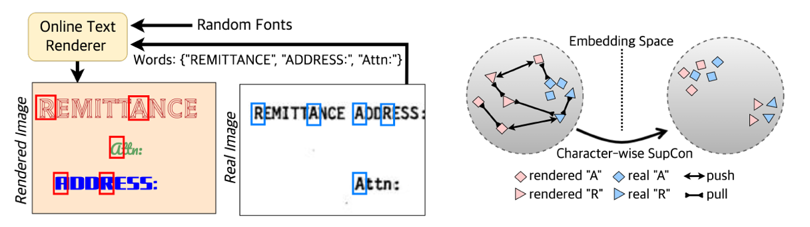

# SCOB: Universal Text Understanding via Character-wise Supervised Contrastive Learning with Online Text Rendering for Bridging Domain Gap 


<div align="center">
    
[Daehee Kim](https://github.com/dnap512), [Yoonsik Kim*](), [DongHyun Kim](https://github.com/dhkim0225), [Yumin Lim](), [Geewook Kim](https://github.com/gwkrsrch), [Taeho Kil]()

[](https://arxiv.org/abs/2309.12382)
[](#how-to-cite)

Official Implementation of SCOB | [Paper](https://arxiv.org/abs/2309.12382) | [Poster](https://drive.google.com/file/d/1LyE-Qai61GXXsGIA64eJyZozsB_yWjsP/view?usp=drive_link)

</div>

## Introduction
**SCOB** Character-wise **S**upervised **C**ontrastive Learning with **O**nline Text Rendering for **B**ridging Domain Gap, is a novel pre-training method for visual document understanding and scene text understanding. SCOB can obtain abundant positive and negative pairs throughout the online rendered and real images. Moreover, SCOB can be pre-trained under weak supervision that does not require coordinate annotation for the detection of real images. Our academic paper, which describes our method in detail and provides full experimental results and analyses, can be found here: 
Our academic paper, which describes our method in detail and provides full experimental results and analyses, can be found here:<br>
> [**SCOB: Universal Text Understanding via Character-wise Supervised Contrastive Learning**](https://arxiv.org/abs/2309.12382).<br>
> [Daehee Kim](https://scholar.google.com/citations?user=x_tWgpsAAAAJ&hl=ko), [Yoonsik Kim](https://scholar.google.com/citations?user=nuxd_BsAAAAJ&hl=ko), [Donghyun Kim](https://scholar.google.co.kr/citations?user=EBC8BMAAAAAJ&hl=ko), [Yumin Lim](https://www.linkedin.com/in/yumin-lim-b129ba17b/?originalSubdomain=kr), [Geewook Kim](https://geewook.kim), [Taeho Kil](https://scholar.google.co.kr/citations?user=cV4h5MsAAAAJ&hl=ko) In ICCV 2023.


## Updates
**_2022-09-26_** First Commit, We release our code, model weights.

## Quick start
```bash
gdown https://drive.google.com/uc?id=1vmWWxvbrscwuywMHpm7_sHkAN0UIJ9_2
unzip scobs.zip

conda env create -f environment.yaml
source activate w_cu113
python train.py --config=configs/pretrain_scob_test.yaml
```

## Software Installation
```bash
conda env create -f environment.yaml
```

## Getting Started

### Data

This repository assumes the following structure of dataset:
```bash
> tree dataset_name
dataset_name
├── test
│   ├── metadata.jsonl
│   ├── {image_path0}
│   ├── {image_path1}
│             .
│             .
├── train
│   ├── metadata.jsonl
│   ├── {image_path0}
│   ├── {image_path1}
│             .
│             .
└── validation
    ├── metadata.jsonl
    ├── {image_path0}
    ├── {image_path1}
              .
              .
```

> cat dataset_name/test/metadata.jsonl
{"file_name": {image_path0}, "ground_truth": "{\"gt_parse\": {ground_truth_parse}, ... {other_metadata_not_used} ... }"}

#### Download Datasets & Weights
We currently provide PubTabNet, CORD, and ICDAR2013 datasets.
```
gdown https://drive.google.com/uc?id=1vmWWxvbrscwuywMHpm7_sHkAN0UIJ9_2
unzip scobs.zip
```

#### For Document Information Extraction
The `gt_parse` is a JSON object that contains full information of the document image, for example, the JSON object for a receipt may look like `{"menu" : [{"nm": "ICE BLACKCOFFEE", "cnt": "2", ...}, ...], ...}`.
- More examples are available at [CORD dataset](https://huggingface.co/datasets/naver-clova-ix/cord-v2).
```bash
python train.py --config=configs/finetune_cord.yaml
```

#### For Table Reconstruction
- More examples are available at [PubTabNet dataset](https://github.com/ibm-aur-nlp/PubTabNet).
```bash
python train.py --config=configs/finetune_pubtabnet.yaml
```


#### For OCR
- More examples are available at [ICDAR2013](https://rrc.cvc.uab.es/?ch=2).


### Training
This is the configuration of SCOB's fine-tuning on [PubTabNet dataset](https://github.com/ibm-aur-nlp/PubTabNet) dataset used in our experiment. 
Description of config file is written in configs/README.md.
We ran this with a eight NVIDIA V100 GPU.

```bash
python train.py --config=configs/finetune_pubtabnet.yaml

```

### Test
TBD

## How to Cite
If you find this work useful to you, please cite:
```bibtex
@inproceedings{kim2023scob,
  title     = {SCOB: Universal Text Understanding via Character-wise Supervised Contrastive Learning with Online Text Rendering for Bridging Domain Gap},
  author    = {Kim, Daehee and Kim, Yoonsik and Kim, DongHyun and Lim, Yumin and Kim, Geewook and Kil, Taeho},
  booktitle = {International Conference on Computer Vision (ICCV2023)},
  year      = {2023}
}
```

## License

```
SCOB
Copyright (c) 2023-present NAVER Cloud Corp.

Permission is hereby granted, free of charge, to any person obtaining a copy
of this software and associated documentation files (the "Software"), to deal
in the Software without restriction, including without limitation the rights
to use, copy, modify, merge, publish, distribute, sublicense, and/or sell
copies of the Software, and to permit persons to whom the Software is
furnished to do so, subject to the following conditions:

The above copyright notice and this permission notice shall be included in all
copies or substantial portions of the Software.

THE SOFTWARE IS PROVIDED "AS IS", WITHOUT WARRANTY OF ANY KIND, EXPRESS OR
IMPLIED, INCLUDING BUT NOT LIMITED TO THE WARRANTIES OF MERCHANTABILITY,
FITNESS FOR A PARTICULAR PURPOSE AND NONINFRINGEMENT. IN NO EVENT SHALL THE
AUTHORS OR COPYRIGHT HOLDERS BE LIABLE FOR ANY CLAIM, DAMAGES OR OTHER
LIABILITY, WHETHER IN AN ACTION OF CONTRACT, TORT OR OTHERWISE, ARISING FROM,
OUT OF OR IN CONNECTION WITH THE SOFTWARE OR THE USE OR OTHER DEALINGS IN THE
SOFTWARE.
```
